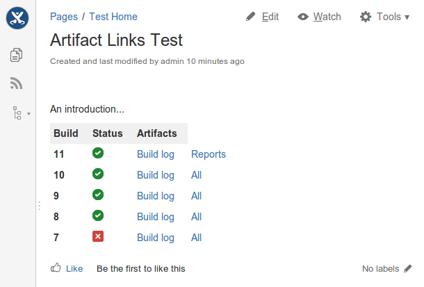
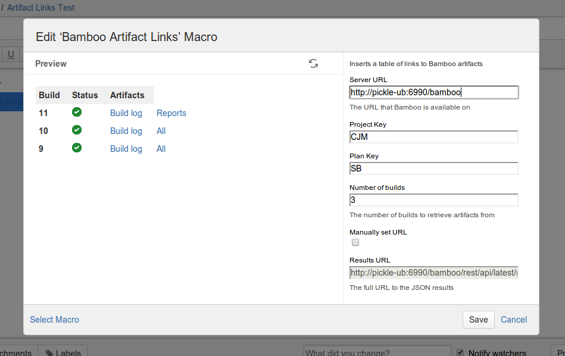

Bamboo Reports
==============

A series of Confluence resources for displaying results from Bamboo in Confluence pages
 
Artifact Links
--------------

__A Confluence macro for displaying a table of artifacts associated with a bamboo plan__

The table shows the ID of the plan result, it's status and then a link for each artifact associated with the result

The macro takes the following configuration values:

+ __Server URL__ the URL for the Bamboo server
+ __Project Key__ the key of the Bamboo project
+ __Plan Key__ the key of the Bamboo plan
+ __Count__ the number of plan results to display 

with the option to override the generated URL

